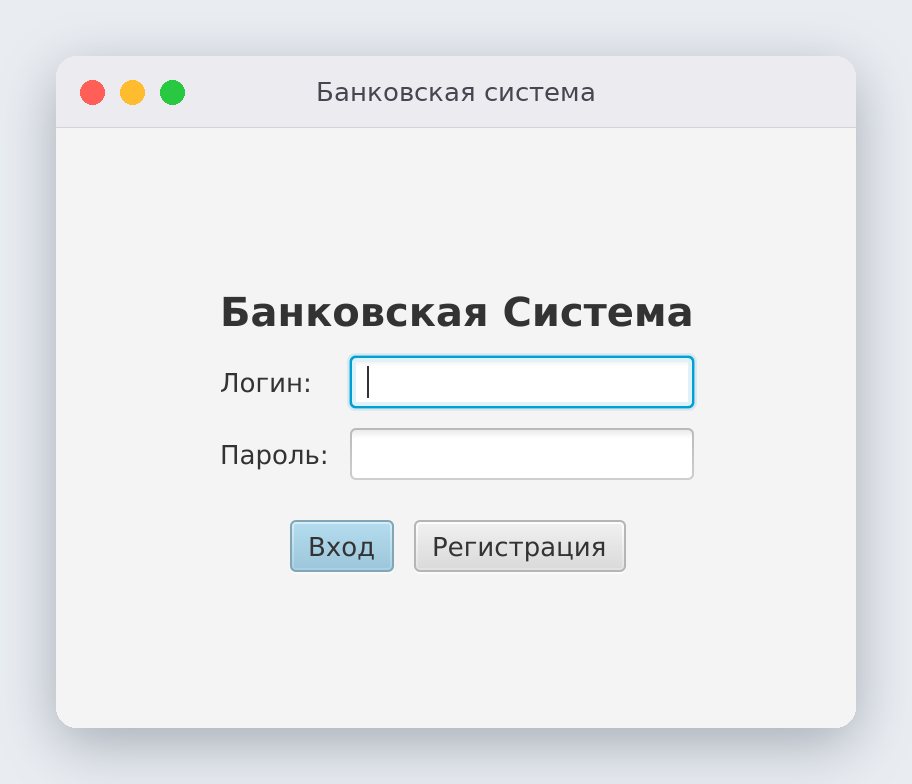
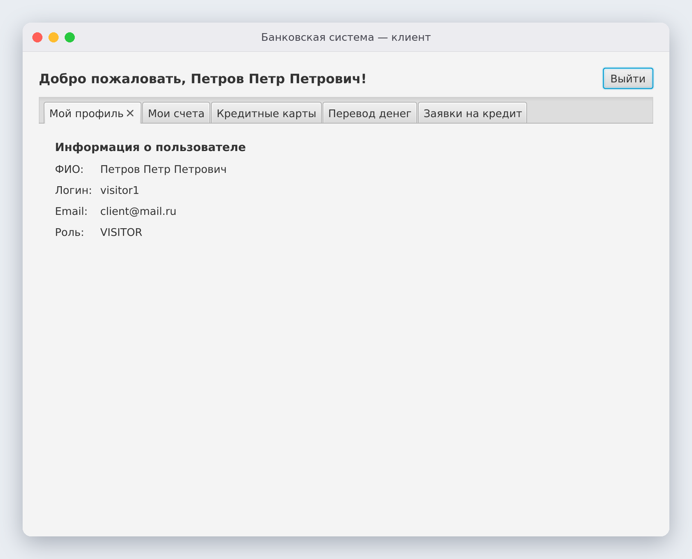
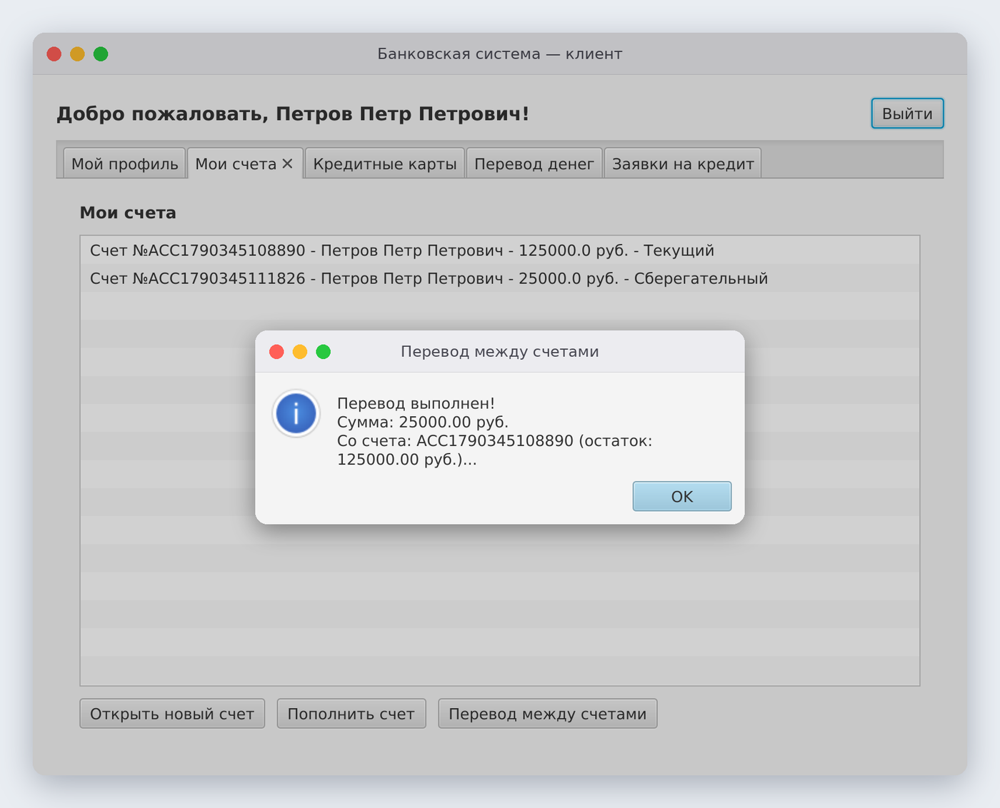
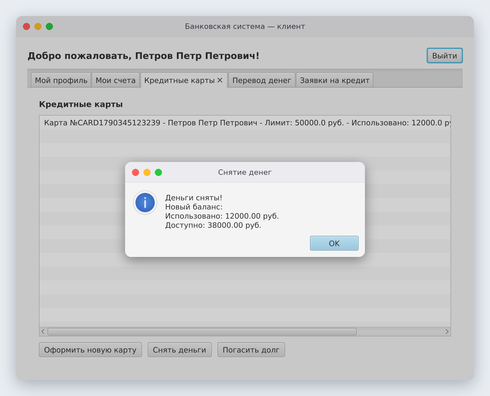
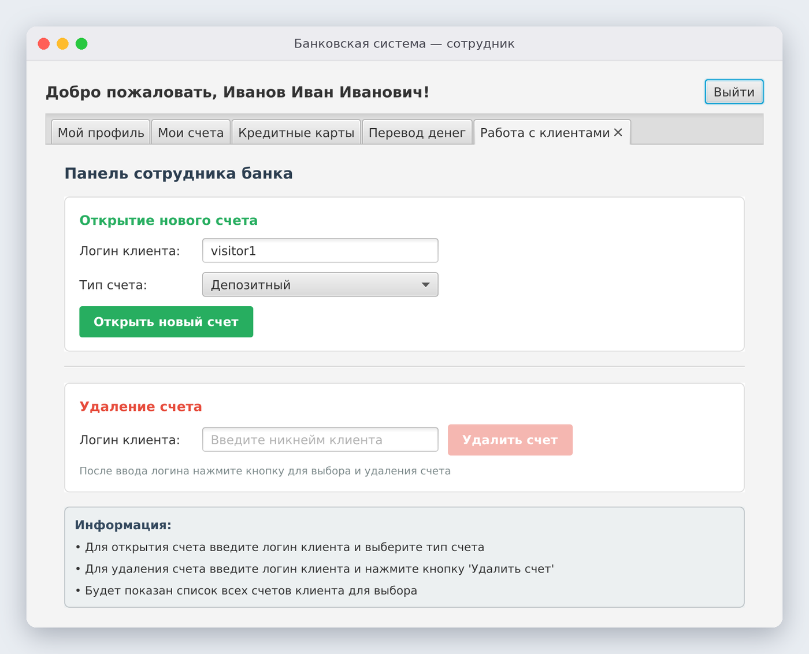
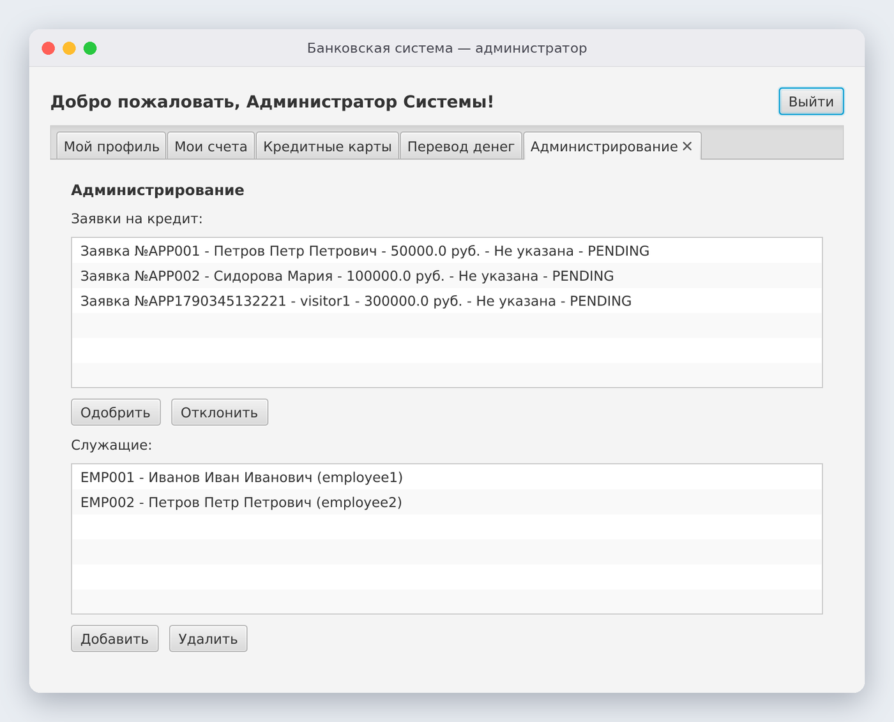

# 🏦 Банковская система

Десктопное приложение на **JavaFX + PostgreSQL**, которое моделирует работу банка с тремя ролями: **клиент**, **сотрудник** и **администратор**. Клиент открывает счета, пополняет их и переводит деньги, оформляет кредитные карты и подаёт заявки на кредит. Сотрудник обслуживает клиентов, а администратор рассматривает заявки и управляет персоналом.


---

## 📸 Как это выглядит

<table>
<tr>
<td width="50%"><b>Вход в систему</b><br></td>
<td width="50%"><b>Профиль клиента</b><br></td>
</tr>
</table>

**Счета клиента:** открытие счёта, пополнение и перевод между своими счетами



**Кредитные карты:** оформление карты с нужным лимитом, снятие денег и погашение долга



<table>
<tr>
<td width="50%"><b>Панель сотрудника</b>: открытие и закрытие счетов клиентов<br></td>
<td width="50%"><b>Панель администратора</b>: заявки на кредит и управление сотрудниками<br></td>
</tr>
</table>

---

## ✨ Возможности

### 👤 Клиент
- Регистрация и вход
- **Счета:** открытие текущего, сберегательного или депозитного счёта, пополнение, перевод между своими счетами
- **Кредитные карты:** «Стандартная» (лимит 50 000 ₽), «Золотая» (100 000 ₽), «Платиновая» (200 000 ₽). С карты можно снимать деньги в пределах лимита и гасить долг
- **Переводы другим пользователям** со счёта или с карты: получатель ищется по логину, перед отправкой нужно подтвердить перевод
- **Заявки на кредит** с указанием суммы

### 🧑‍💼 Сотрудник
- Открытие счёта клиенту по его логину с выбором типа счёта
- Удаление счёта клиента

### 🛡️ Администратор
- Одобрение и отклонение заявок на кредит
- Добавление и удаление сотрудников

### ⚙️ Под капотом
- Интерфейс свёрстан в **FXML**: отдельный файл и контроллер на каждую вкладку (`accounts-tab`, `cards-tab`, `transfer-tab`, `loans-tab`, `employee-tab`, `admin-tab`)
- Набор вкладок **зависит от роли** пользователя
- Данные хранятся в **PostgreSQL**. Таблицы `users`, `accounts`, `credit_cards`, `loan_applications` и `employees` создаются автоматически при первом запуске
- Слой **репозиториев** с интерфейсами и in-memory реализациями
- Перед любой операцией проверяются вводимые данные: сумма должна быть положительной, средств должно хватать, лимит карты нельзя превысить, самому себе переводить нельзя
- Вкладки со счетами и картами **автоматически обновляются** каждые несколько секунд

## 🚀 Запуск (Windows)

**Нужно:** JDK 23+ (из-за JavaFX 25) и PostgreSQL.

1. Создай базу данных:
   ```sql
   CREATE DATABASE "bank-system";
   ```
   Программа подключается к `localhost:5432` с логином и паролем `postgres/postgres`.
2. Перейди в папку `program` и запусти `start.bat`. Он выполнит команду:
   ```bat
   java --module-path "javafx-sdk-25\lib" --add-modules javafx.controls,javafx.fxml -jar demo3.jar
   ```
   Если нужно видеть консольный лог, используй `start2.bat`.

### 🔑 Тестовые аккаунты

| Роль | Логин | Пароль |
|---|---|---|
| Клиент | `visitor1` | `vis123` |
| Сотрудник | `employee1` | `emp123` |
| Администратор | `admin` | `admin123` |

## 🛠️ Стек

Java · JavaFX (FXML, Controls) · JDBC · PostgreSQL · IntelliJ IDEA
